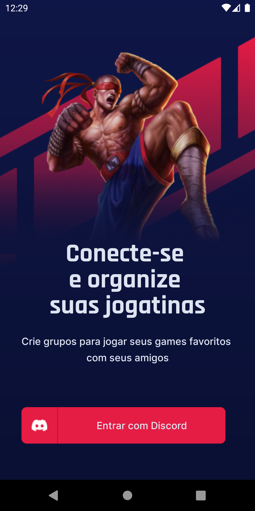
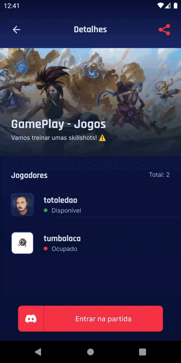

<!-- PROJECT SHIELDS -->
<!-- See the bottom of this document for the declaration of the reference variables -->

[![License: MIT][license-shield]][license-url]


[![React Native][reactnative-shield]][reactnative-url]
[![Type Script][typescript-shield]][typescript-url]

[![LinkedIn][linkedin-shield]][linkedin-url]


<!-- PROJECT LOGO -->
<br />
<p align="center">
  <a href="https://github.com/totoledao/gameplay-app-nlwtogether">
    
  </a>

  <h3 align="center">GamePlay</h3>

  <p align="center">
    Schedule and manage your gaming sessions!
    <br />
    <a href="https://github.com/totoledao/gameplay-app-nlwtogether"><strong>Explore the docs »</strong></a>    
  </p>
</p>


<!-- TABLE OF CONTENTS -->
<details open="open">
  <summary><h2 style="display: inline-block">Table of Contents</h2></summary>
  <ol>
    <li>
      <a href="#about-the-project">About The Project</a>
      <ul>
        <li><a href="#built-with">Built With</a></li>
        <li><a href="#technologies">Technologies</a></li>
      </ul>
    </li>
    <li>
      <a href="#getting-started">Getting Started</a>
      <ul>
        <li><a href="#prerequisites">Prerequisites</a></li>
        <li><a href="#installation">Installation</a></li>
      </ul>
    </li>    
    <li><a href="#usage">Usage</a></li>
    <li><a href="#contributing">Contributing</a></li>
    <li><a href="#license">License</a></li>
    <li><a href="#contact">Contact</a></li>    
  </ol>
</details>


<!-- ABOUT THE PROJECT -->
## About The Project


**Schedule your games, check what games are coming, categorize and sort your games by Ranked, Duel, Training or For Fun, share discord invites from your server with your friends and never forget a gaming session again!**

App created during Next Level Week Together by [Rocketseat](https://rocketseat.com.br/).

### Built With

* [React Native](https://reactnative.dev/)
* [Typescript](https://www.typescriptlang.org/)
* [Expo](https://expo.io/)

### Technologies
* OAuth2 Discord
* Context API
* Async Storage
* Vector Icons
* React Native Svg
* Svg Transform
* Axios
* Gradient colors
* Expo Google Fonts
* React Navigation Stack
* React Native Gesture Handler
* Expo Authentication
* React Native Share
* Deep Link

<!-- GETTING STARTED -->
## Getting Started

To get a local copy up and running follow these simple steps.

### Prerequisites

* npm
  ```sh
  npm install npm@latest -g
  ```
* Expo CLI
  ```sh
  npm install --global expo-cli
  ```

### Installation

1. Clone the repo
   ```sh
   git clone https://github.com/totoledao/gameplay-app-nlwtogether.git
   ```
2. Install dependencies
   ```sh
   npm install
   ```
3. Start the development server with expo
   ```sh
   expo start
   ```
4. Get your APP OAuth2 credentials at [Discord Developer Portal](https://discord.com/developers/applications) and create a **.env** file using them
   ```sh
    REDIRECT_URI=
    SCOPE=
    RESPONSE_TYPE=
    CLIENT_ID=
    CDN_IMAGE=
   ```

<!-- USAGE EXAMPLES -->
## Usage



Login using your Discord account


Schedule your gaming session



Invite your friends to join your server

**NOTE:** Currently you must [enable the server widget](https://dev.fandom.com/wiki/DiscordIntegrator/instructions) for the app to be able to get the player status and to share instant invite links. Only the owner of the server can share invites.

<!-- CONTRIBUTING -->
## Contributing

Contributions are what make the open source community such an amazing place to be learn, inspire, and create. Any contributions you make are **greatly appreciated**.

1. Fork the Project
2. Create your Feature Branch (`git checkout -b feature/AmazingFeature`)
3. Commit your Changes (`git commit -m 'Add some AmazingFeature'`)
4. Push to the Branch (`git push origin feature/AmazingFeature`)
5. Open a Pull Request


<!-- LICENSE -->
## License

Distributed under the MIT License. See [`LICENSE`][license-url] for more information.


<!-- CONTACT -->
## Contact

Guilherme Toledo - guilherme-toledo@live.com

[](https://www.linkedin.com/in/guilhermemtoledo/)
[](https://www.facebook.com/totoledao)
[](https://www.instagram.com/totoledao)
[](https://www.github.com/totoledao)


Project Link: [https://github.com/totoledao/gameplay-app-nlwtogether](https://github.com/totoledao/gameplay-app-nlwtogether)

<!-- MARKDOWN LINKS & IMAGES -->
<!-- https://www.markdownguide.org/basic-syntax/#reference-style-links -->

[license-shield]: https://img.shields.io/badge/License-MIT-blue.svg
[license-url]: https://github.com/totoledao/gameplay-app-nlwtogether/blob/main/MIT-LICENSE.txt
[linkedin-shield]: https://img.shields.io/badge/-LinkedIn-black.svg?style=for-the-badge&logo=linkedin&colorB=0e76a8
[linkedin-url]: http://www.linkedin.com/in/guilhermemtoledo
[reactnative-shield]:https://img.shields.io/badge/React_Native-20232A?style=for-the-badge&logo=react&logoColor=61DAFB
[reactnative-url]: https://reactnative.dev/
[typescript-shield]:https://img.shields.io/badge/TypeScript-007ACC?style=for-the-badge&logo=typescript&logoColor=white
[typescript-url]: https://www.typescriptlang.org/